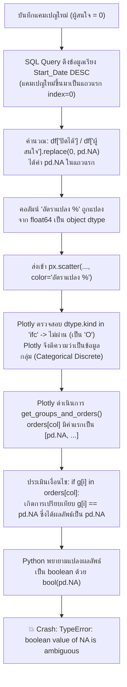

# กรณีศึกษา (Case Study): การแก้ไขข้อผิดพลาด `TypeError: boolean value of NA is ambiguous` ในหน้างานการตลาด

---

## 1. ข้อมูลสรุปของปัญหา (Executive Summary)

| หัวข้อ | รายละเอียด |
| :--- | :--- |
| **รหัสเหตุการณ์** | INC-20260919-PD-NA |
| **ระบบที่เกิดปัญหา** | ระบบบริหารงานลูกค้าอัจฉริยะ (Smart CRM Analytics - `dddsproject`) |
| **หน้าจอที่เกิดข้อผิดพลาด** | `pages/1_marketing.py` (หน้างานการตลาด - แท็บ 1: รายการแคมเปญ) |
| **ข้อความแสดงข้อผิดพลาด** | `TypeError: boolean value of NA is ambiguous` |
| **สาเหตุหลัก (Root Cause)** | การใช้ `.replace(0, pd.NA)` ในการป้องกันปัญหาหารด้วยศูนย์ (Division by Zero) ส่งผลให้คอลัมน์กลายเป็น `object` dtype ที่บรรจุ `pd.NA` ซึ่งเมื่อถูกส่งต่อให้ Plotly Express (`px.scatter`) นำไปกำหนดค่า `color` Plotly จะมองเป็นหมวดหมู่ (Categorical) และเกิดการเปรียบเทียบในฟังก์ชันจัดกลุ่ม `if g[i] in orders[col]:` จนเกิด `bool(pd.NA)` ที่ไม่สามารถประเมินค่าความจริงได้ |
| **ผลกระทบ** | ผู้ใช้งานบันทึกแคมเปญใหม่สำเร็จ แต่เมื่อระบบรีเฟรชหน้าเพื่อแสดงกราฟเปรียบเทียบงบประมาณกับจำนวนผู้สนใจ หน้าจอจะแครช (Crash) ทันที |
| **แนวทางแก้ไข** | เปลี่ยนจากการใช้ `pd.NA` มาใช้ `np.where(...)` ร่วมกับค่าทศนิยมชัดเจน (`0.0` สำหรับอัตราแปลง และ `np.nan` สำหรับต้นทุนต่อราย) เพื่อคงประเภทข้อมูลเป็น `float64` |
| **การทดสอบและป้องกัน** | เพิ่ม Regression Test ใน `tests/test_dfd_flows.py` และตรวจสอบผ่าน `pytest` (36/36 ผ่านทั้งหมด) |

---

## 2. ลำดับเหตุการณ์และอาการที่พบ (Symptoms & Traceback)

### 2.1 พฤติกรรมที่พบ
เมื่อผู้ใช้ล็อกอินด้วยบทบาทฝ่ายการตลาด (`marketing1`) หรือแอดมิน (`admin`) แล้วเข้าสู่หน้า **"📢 งานการตลาด"** (`pages/1_marketing.py`):
1. ไปที่แท็บ **"➕ สร้างแคมเปญ"** แล้วกรอกข้อมูลสร้างแคมเปญใหม่ เช่น "Year-End Mega Sale 2026"
2. กดปุ่ม **"💾 บันทึกแคมเปญ"** ระบบจะบันทึกข้อมูลลงฐานข้อมูล `CAMPAIGN` และล้างแคชด้วย `st.cache_data.clear()`
3. แคมเปญใหม่ที่เพิ่งสร้างยังไม่มีผู้สนใจติดต่อเข้ามา ทำให้ค่า `ผู้สนใจ = 0` และ `ปิดได้ = 0`
4. เมื่อหน้าจอรีรันกลับมาที่แท็บ 1 หรือรีเฟรชหน้าจอ หน้าจอจะแสดงหน้าต่างสีแดงพร้อมข้อความ:
   ```text
   TypeError: boolean value of NA is ambiguous
   ```

### 2.2 Call Stack Trace จาก Streamlit

```text
TypeError: boolean value of NA is ambiguous

Traceback:
File ".../pages/1_marketing.py", line 45, in <module>
  fig = px.scatter(df, x="งบประมาณ", y="ผู้สนใจ", size="ปิดได้",
                   color="อัตราแปลง %", hover_name="ชื่อแคมเปญ",
                   color_continuous_scale="Greens", size_max=45)
File ".../plotly/express/_chart_types.py", line 66, in scatter
  return make_figure(args=locals(), constructor=go.Scatter)
File ".../plotly/express/_core.py", line 2103, in make_figure
  groups, orders = get_groups_and_orders(args, grouper)
File ".../plotly/express/_core.py", line 2060, in get_groups_and_orders
  sorted_group_names = sorted(
File ".../plotly/express/_core.py", line 2062, in <lambda>
  key=lambda g: orders[col].index(g[i]) if g[i] in orders[col] else -1,
File "missing.pyx", line 392, in pandas._libs.missing.NAType.__bool__
```

---

## 3. การวิเคราะห์สาเหตุเชิงลึก (Deep Root Cause Analysis)

### 3.1 ความแตกต่างระหว่าง `np.nan` (IEEE 754) กับ `pd.NA` (Nullable Scalar)
- **`np.nan` (Not a Number)**: เป็นค่าทศนิยมมาตรฐานตามมาตรฐาน IEEE 754 Floating-Point ซึ่งจัดอยู่ในประเภทข้อมูล `float64`
- **`pd.NA` (`NAType`)**: ถูกนำมาใช้ใน Pandas ยุคหลังเพื่อเป็นตัวแทนของ Missing Value ในระบบตรรกะ 3 สถานะ (Three-Valued Logic: True, False, Unknown)

### 3.2 กลไกการเกิดข้อผิดพลาดแบบลูกโซ่ (Chain Reaction)



#### รายละเอียดของปัญหาแต่ละขั้น:
1. **การแทนที่ค่า 0 ด้วย `pd.NA` ในโค้ดเดิม**:
   ```python
   # โค้ดเดิม
   df["อัตราแปลง %"] = (100 * df["ปิดได้"] / df["ผู้สนใจ"].replace(0, pd.NA)).round(1)
   df["ต้นทุน/ผู้สนใจ"] = (df["งบประมาณ"] / df["ผู้สนใจ"].replace(0, pd.NA)).round(0)
   ```
   เมื่อแคมเปญใหม่มีค่า `ผู้สนใจ == 0` การเรียก `.replace(0, pd.NA)` จะใส่ `pd.NA` เข้าไป ส่งผลให้ Pandas แปลงชุดข้อมูลของคอลัมน์นั้นจาก `float64` เป็น `object`

2. **การจัดหมวดหมู่สีใน Plotly Express**:
   ฟังก์ชัน `px.scatter(..., color="อัตราแปลง %")` มีการตรวจสอบว่าคอลัมน์สีเป็นค่าต่อเนื่อง (Continuous) หรือไม่ ด้วยคำสั่ง:
   ```python
   # ภายใน Plotly Express
   def _is_continuous(df, col):
       return df[col].dtype.kind in "ifc"  # i=int, f=float, c=complex
   ```
   เนื่องจากคอลัมน์กลายเป็น `object` (`dtype.kind == 'O'`) Plotly จึงมองว่าไม่ใช่ตัวเลขต่อเนื่อง แต่เป็นหมวดหมู่ (Categorical discrete colors)

3. **จุดระเบิดใน `orders[col]`**:
   เมื่อเป็น Categorical Plotly จึงพยายามจัดกลุ่มและจัดเรียงหมวดหมู่ใน `plotly/express/_core.py:2062`:
   ```python
   key=lambda g: orders[col].index(g[i]) if g[i] in orders[col] else -1
   ```
   เนื่องจากแคมเปญใหม่อยู่แถวบนสุด ค่าแรกใน `orders[col]` คือ `pd.NA` เมื่อมีการตรวจ `g[i] in orders[col]` ไพธอนจะเปรียบเทียบค่า `g[i] == pd.NA` ซึ่งในระบบตรรกะของ Pandas จะคืนค่าเป็น `pd.NA` (ไม่ใช่ True หรือ False)
   และเมื่อนำค่า `pd.NA` ไปใส่ในประโยคเงื่อนไข `if <condition>:` ไพธอนจะเรียก `NAType.__bool__` ซึ่งโยน Exception ทันที:
   ```python
   TypeError: boolean value of NA is ambiguous
   ```

---

## 4. แนวทางการแก้ไข (Solution & Implementation)

### 4.1 การปรับปรุงโค้ดใน `pages/1_marketing.py`
เปลี่ยนมาใช้ `np.where(condition, x, y)` ของ NumPy ซึ่ง:
- ประเมินเงื่อนไขในระดับเวกเตอร์อย่างมีประสิทธิภาพ
- เมื่อ `ผู้สนใจ == 0` อัตราการปิดการขาย (`อัตราแปลง %`) ให้กำหนดเป็น `0.0%` อย่างชัดเจน (เพราะยังไม่มีผู้สนใจ จึงยังไม่มีการแปลง)
- สำหรับ `ต้นทุน/ผู้สนใจ` เมื่อยังไม่มีผู้สนใจ ให้กำหนดเป็น `np.nan` ซึ่งคงความเป็น `float64` และ Streamlit Dataframe แสดงผลเป็นช่องว่างได้อย่างถูกต้องสวยงาม
- Plotly Express จะมองเห็น `dtype.kind == 'f'` ทำให้แสดงผล Color Scale แบบ Continuous ได้อย่างถูกต้องสมบูรณ์

```diff
-import pandas as pd
+import numpy as np
+import pandas as pd
 import plotly.express as px
 import streamlit as st
 
 ...
-    df["อัตราแปลง %"] = (100 * df["ปิดได้"] / df["ผู้สนใจ"].replace(0, pd.NA)).round(1)
-    df["ต้นทุน/ผู้สนใจ"] = (df["งบประมาณ"] / df["ผู้สนใจ"].replace(0, pd.NA)).round(0)
+    df["อัตราแปลง %"] = np.where(
+        df["ผู้สนใจ"] > 0,
+        (100 * df["ปิดได้"] / df["ผู้สนใจ"]).round(1),
+        0.0,
+    )
+    df["ต้นทุน/ผู้สนใจ"] = np.where(
+        df["ผู้สนใจ"] > 0,
+        (df["งบประมาณ"] / df["ผู้สนใจ"]).round(0),
+        np.nan,
+    )
```

### 4.2 การปรับปรุงเชิงป้องกันใน `analytics/campaign_roi.py`
ในโมดูลวิเคราะห์ผลตอบแทนแคมเปญ (`campaign_roi.py`) มีการคำนวณ `CAC`, `ROAS` และ `Avg_Deal_Size` ซึ่งเคยใช้ `.replace(0, pd.NA)` เช่นกัน จึงได้ปรับปรุงมาใช้ `np.where` และ `np.nan` เพื่อป้องกันปัญหาในอนาคต:

```diff
-import pandas as pd
+import numpy as np
+import pandas as pd
 from scipy import stats
 
 def campaign_overview() -> pd.DataFrame:
     df = run_query("SELECT * FROM V_CAMPAIGN_ROI ORDER BY ROI DESC")
     if df.empty:
         return df
-    df["CAC"] = (df["Budget_Cost"] /
-                 df["Converted_Leads"].replace(0, pd.NA)).round(2)
-    df["ROAS"] = (df["Revenue"] / df["Budget_Cost"].replace(0, pd.NA)).round(2)
+    df["CAC"] = np.where(
+        df["Converted_Leads"] > 0,
+        (df["Budget_Cost"] / df["Converted_Leads"]).round(2),
+        np.nan,
+    )
+    df["ROAS"] = np.where(
+        df["Budget_Cost"] > 0,
+        (df["Revenue"] / df["Budget_Cost"]).round(2),
+        np.nan,
+    )
     df["ROI_%"] = (df["ROI"] * 100).round(2)
-    df["Avg_Deal_Size"] = (df["Revenue"] /
-                           df["Converted_Leads"].replace(0, pd.NA)).round(2)
+    df["Avg_Deal_Size"] = np.where(
+        df["Converted_Leads"] > 0,
+        (df["Revenue"] / df["Converted_Leads"]).round(2),
+        np.nan,
+    )
     df["Verdict"] = pd.cut(df["ROI_%"], bins=[-1e9, 0, 100, 1e9],
                            labels=["❌ ขาดทุน", "⚠️ พอไปได้", "✅ คุ้มค่า"])
     return df
```

---

## 5. การทดสอบและการยืนยันผล (Verification & Testing)

### 5.1 การทดสอบจำลองเหตุการณ์ก่อนและหลังแก้ (Reproduction Script)
ทำการรันการจำลองผ่าน Streamlit AppTest:
1. สร้างแคมเปญใหม่ที่มี 0 Leads
2. โหลดหน้าจอ `pages/1_marketing.py` ซ้ำ เพื่อจำลองการแสดงผลแท็บ 1

**ผลลัพธ์ก่อนแก้:**
```text
Uncaught app exception: TypeError: boolean value of NA is ambiguous
```

**ผลลัพธ์หลังแก้:**
```text
SUCCESS: Tab 1 loaded without any exception!
```

### 5.2 การเพิ่ม Regression Test ในชุดทดสอบอัตโนมัติ
ในไฟล์ `tests/test_dfd_flows.py` ในฟังก์ชัน `test_1_1_create_campaign`:
```python
def test_1_1_create_campaign(db):
    at = _at("pages/1_marketing.py", "marketing")
    [t for t in at.text_input if t.label == "ชื่อแคมเปญ *"][0].set_value("แคมเปญเทส 1.1")
    _btn(at, "บันทึกแคมเปญ").click().run()
    assert not at.exception
    row = db("SELECT Employee_ID FROM CAMPAIGN WHERE Campaign_Name='แคมเปญเทส 1.1'")
    assert row and row[0][0] == "EMP002"

    # Regression check: ยืนยันว่าหน้าแท็บ 1 สามารถเรนเดอร์ Scatter plot ได้อย่างสมบูรณ์แม้มีแคมเปญที่มี 0 Leads
    at_view = _at("pages/1_marketing.py", "marketing")
    assert not at_view.exception
```

### 5.3 ผลการรันชุดทดสอบทั้งหมด
- **Pytest (Unit & Integration Tests)**:
  ```text
  36 passed in 24.02s (100% Success)
  ```
- **Bootstrap Verification (`python bootstrap.py --check`)**:
  ```text
  ✅ ผ่านทั้งหมด — โปรเจกต์พร้อมรัน
  ```

---

## 6. แนวทางปฏิบัติที่ดีที่สุดเพื่อป้องกันปัญหาซ้ำ (Best Practices & Guidelines)

1. **หลีกเลี่ยงการใช้ `pd.NA` กับคอลัมน์ตัวเลขที่ต้องส่งต่อให้ Data Visualization**:
   - เครื่องมือแสดงผลทางสถิติ เช่น Plotly, Seaborn, Matplotlib ออกแบบมาสำหรับมาตรฐาน `float64` / `np.nan`
   - การใส่ `pd.NA` จะทำให้คอลัมน์กลายเป็น `object` dtype ทันที ซึ่งตัดการทำงานของฟีเจอร์ตัวเลขต่อเนื่อง (Continuous Scales)
2. **การจัดการกรณีหารด้วยศูนย์ (Zero Division Handling)**:
   - ใช้ `np.where(denominator > 0, numerator / denominator, default_value)` เพื่อกำหนดค่า fallback ที่ชัดเจนและควบคุมประเภทตัวแปรได้ 100%
   - หากต้องการสื่อถึง "ยังไม่มีอัตราแปลง" ให้พิจารณาใช้ `0.0` หรือ `np.nan`
3. **การทดสอบแบบ End-to-End หลังบันทึกข้อมูล**:
   - เมื่อมีการทดสอบฟังก์ชัน `Create` หรือ `Insert` ไม่ควรหยุดแค่การตรวจดูว่าแถวเข้าฐานข้อมูลหรือไม่ แต่ควรจำลองการอ่านข้อมูลนั้นกลับมาแสดงผลบน Dashboard ด้วยเสมอ เพื่อดักจับข้อผิดพลาดเรื่อง Edge Case Data
